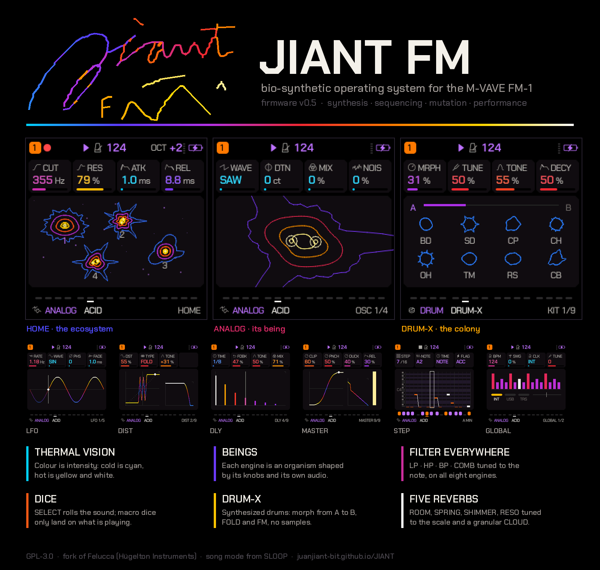
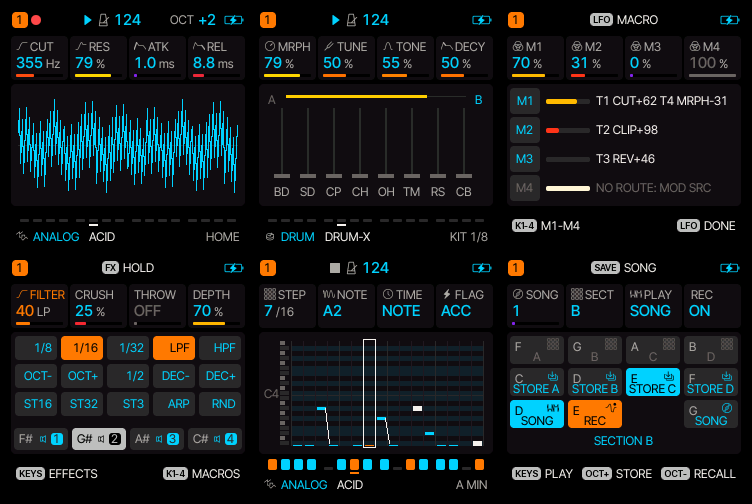

# JIANT FM

**Bio-synthetic operating system for the M-VAVE FM-1** — synthesis, sequencing, mutation, performance.

[](LICENSE)
[](https://juanjiant-bit.github.io/JIANT/)



JIANT FM is an alternative firmware for the **M-VAVE FM-1**, made for playing live and building whole songs without
a computer. It is a fork of [Felucca](https://github.com/hugelton/Felucca) 1.1.5.1 by Hügelton Instruments (GPL-3.0)
and takes its song system from [SLOOP](https://github.com/isod89/sloop-fm1).

**▶ [Try it in the browser](https://juanjiant-bit.github.io/JIANT/)** · **[Web installer](https://juanjiant-bit.github.io/JIANT/webapp/installer/)** · **[Web editor](https://juanjiant-bit.github.io/JIANT/webapp/editor/)**: the emulator runs the same code as
the FM-1, with sound, and is played with your computer keyboard or the mouse. The emulator, the installer and the
editor update themselves with every change merged into `main`.

> **Status: in development (v0.5.2).** It builds and passes every test (Felucca's and its own), but **it has not been
> tested thoroughly on a real FM-1 yet**. Back up the flash before installing it.

## Changelog

Every update is listed here, newest first.

### v0.5.2
- **BYTE: new formulas, no silent starts.** The 17 most familiar one-liners (`t*(42&t>>10)`, `t&t>>8` and friends)
  were replaced by less obvious ones: rhythms and arpeggios after Tejeez, xpansive's "lost in space", a melody of
  `t>>9` modulo 13, textures built from `t%24` and `t%19`, and more. Each formula now starts where it is already
  moving: 14 of the 32 used to sit silent for up to half a second after the note; now all 32 sound within 30 ms.
- **FLOAT: 32 formulas** (16 new): drifting unison, sub-and-fifth organ, self-FM, glides through partials, gated
  rhythms, CZ-style phase distortion, formants, breath, harmonic chords, breathing bells, stepped sines, PWM, random
  held partials, hard sync, three-against-four. **CHIP now sets FLOAT's resolution**: FULL (smooth, the default),
  4BIT, 4B/2, 1BIT, STEP.
- **LOFI presets in order**: browsing shows the BYTE presets, then FLOAT, then the classic chip sounds.
- **Parameter check**: NOISE's resonance is now **PEAK** (it sat next to the FILTER page's RES with the same name).

### v0.5.1
- **Master no longer smears the mix.** The always-on leveler was riding every hit: measured on the demo song, its
  gain swung about 5 dB inside each beat and the limiter was working 95 % of the time. Now it follows the song's
  loudness over about a second and a half (0.3 dB of movement per beat) and leaves the limiter more headroom (active
  less than half as often, and lighter). Same loudness, transients and space come back.
- **CLOUD is bigger**: 12 overlapping grains instead of 8, each one a few cents off (a chorused shimmer), the grains
  fed back into the cloud so it keeps building, and a louder bloom.
- **RESO rings much longer**: the top of SIZE now sustains for many seconds.
- **Chorus rebuilt as an ensemble**: three voices swept a third of a cycle apart, left, right and centre: stereo
  even with WIDTH at 0, wider with it.
- **New LOFI wave: FLOAT** (floatbeat, bytebeat's smooth sibling): 16 formulas made of sines (FM, harmonic
  arpeggios, folded sines, beating pairs, plucks, pads), tuned to the note; VAR, BEND, RES and LOOP as in BYTE.
  Three new presets: FLOAT FM, FLOAT ARP, FLOAT PAD.
- **New DRUM-X page: X-MOD**, a modulator for the whole kit: a tempo-synced LFO on MORPH (RATE from 4 bars to
  1/32, DPTH, SHPE: sine, triangle, saw, ramp, sample & hold) and RAND (every hit its own MORPH and tune). Saved
  with the kit; the A–B bar shows the morph moving.

### v0.5
First public release.

## The idea

A pocket synthesizer shouldn't feel like a menu. JIANT starts from a simple question: what if the device behaved
less like a tool and more like an organism?

That's why everything in JIANT is alive and visible. The screen works like a **thermal camera**: colour isn't
decoration, it's intensity. Cold is cyan and violet, hot is red, orange, yellow and white. A high parameter burns; a
sounding voice glows; silence cools down. Each engine is a **being**, a protozoan drawn in lines whose shape comes
from what you're playing: open the filter and it grows spines, raise the resonance and its membrane vibrates, detune
the oscillators and its nuclei drift apart. HOME is an **ecosystem**: four creatures, one per track, breathing with
their own audio. You don't need to read numbers to know what's going on; you can see it.

At the same time, what is technical is shown as technical. The LFO runs at its rate, the envelope shows where the
voice is, the distortion draws its transfer curve, the delay its echoes, the reverb its response. The organic invites
you to play; the technical lets you understand what you did.

The second idea is that **randomness is an invitation, not an accident**. Every session starts with macros rolled
towards what your sounds have; SELECT rolls the sound's dice on any page; macro dice only land on what is playing.
The system pushes you to move things and always leaves you near something that works: the dice start from factory
presets and vary around them, never from nothing.

The third is that **everything is playable and everything is recordable**. Effects are played on the keys and land
in an automation lane; knobs record their movement; songs are built from bars and scenes, and recorded while you
play them. No computer, no samples: everything is synthesized in real time on a chip designed for something else.

And the last one is a discipline: **lightweight**. Every graphic is a handful of lines, every effect fits in the
audio CPU budget, the signature shown at power-on is 428 bytes. An instrument that feels big inside a small device.

## The system

### A living screen



*HOME (the ecosystem), ANALOG's being, the DRUM-X colony, the running LFO, the DIST curve and the GLOBAL bar, exactly
as the firmware draws them.*

- **Thermal palette**: values, curves, steps, hits and notes are coloured by intensity (cyan → blue → violet → red →
  orange → yellow → white). Selection is violet and active is orange. Font:
  [Chakra Petch](https://github.com/m4rc1e/Chakra-Petch): technical, legible, primitive-tech.
- **HOME, the ecosystem**: one being per track (its species from its engine, its shape from its four knobs). Each one
  heats up, swells and moves with its own audio; the selected track is drawn bigger; muted ones go dark; in silence
  they all stay still.
- **Engine pages**: the sound's being drawn in isotherms (four contours of the same body, cold edge, hot core). The
  knobs read as what they are: **CUT** grows spines (more harmonics, spikier), **RES** makes the membrane vibrate,
  **DTN/SPRD** splits two nuclei, **NOIS/RAND/CRSH** frays the edge, **WAVE** changes the lobes.
- **DRUM-X, the colony**: one being per kit sound, each with its own shape (round kick, spiky snare, fringed hats,
  clustered clap, star-shaped cowbell) that swells and heats up when it hits.
- **Live technical graphs**: LFO (the wave runs at its rate, with playhead and current value), ENV (a dot travels the
  curve with the sounding voice), DIST (transfer curve by TYPE and TONE response), DLY and DLY 2 (the echoes, L and
  R), REVERB and REVERB 2 (the impulse response, stereo, drawn per model), CHORUS (the three modulated lines), MASTER
  (clipper curve, PUNCH shape, how much DUCK pulls down), ENV/LFO DEST (bipolar columns under each knob, lit by what
  they send), VOICE (one cell per voice and the glide curve), GLOBAL (the bar in thermal columns with swing, clock and
  tuning).
- **Load meter**: five small bars next to the battery showing the current audio load.
- **Power-on**: the "Jiant FM1" signature is written stroke by stroke in thermal colours (MENU > ANIM OFF: it shows
  up whole).

### Engines
Eight engines, all synthesis, no samples: **ANALOG, FM6, PHASE, LOFI, VOICE, WHEEL, NOISE and DRUM (DRUM-X)**.
- **ANALOG**: two oscillators with **INT** (an interval of ±24 semitones: fifths, octaves) and DTN; besides SAW, SQR,
  TRI, SIN and PWM it has **SYNC**, **RING** and **SAW3** (three saws). Its filter is per voice.
- **FM6**: Dexed's engine (imports .syx), with its algorithms drawn.
- **PHASE**: phase distortion with **FB** (the output feeds back into the phase: from hard edge to growl).
- **LOFI**: 1, 4 and 8-bit chip with **BYTE** (bytebeat: 32 formulas picked with ALGO and bent with VAR). In BYTE,
  **BEND** folds time, **RES** adds filter resonance and **LOOP** repeats a short stretch of the formula: the noise
  becomes a tone tuned to the note. **FLOAT** (0.5.1) is floatbeat: 32 smooth formulas of sines, tuned to the note.
- **VOICE** (formants, after klattsch), **WHEEL** (drawbar organ) and **NOISE** (coloured and metallic noise).
- **FILTER on every engine** (EDIT > FILTER): **TYPE** LP, HP, BP or **COMB** (a comb tuned to the note you're
  playing; CUT moves it ±32 semitones and RES is how much it rings), **CUT** and **RES**. On ANALOG it's its per-voice
  filter, with DRV; on LOFI it's per voice too (its CUT and RES are the ones on this page); on the others it's a filter
  on the track that follows the LFO and the envelope (LFO/ENV DEST FLT), and its DRV is the track's DIST.

### DRUM-X: synthesized drums with morph
An 8-sound kit (BD SD CP CH OH TM RS CB) generated in real time, Microtonic style.
- Each sound has two sides, **A** and **B**; **MORPH** (KNOB 1) moves between them.
- **FOLD** runs each sound's oscillator through a wavefolder after its envelope: the hit starts bright and the tail
  returns to the clean wave. **FM** changes the timbre with harmonic FM in 8 bands; plus TUNE, TONE, DECAY, NOISE and
  DRV.
- **EDIT > SOUND 3** (per sound): **PMOD** picks how the pitch moves (DECAY, LONG like the 808, random NOISE, SINE),
  **DRV** saturates the oscillator for dense kicks, and **WAVE** changes the waveform.
- **Group mutes** (KICK, SNARE, HAT, PERC) with GLO held and **per-sound mutes** with EDIT held.
- **EDIT > X-MOD** (0.5.1): a tempo-synced LFO on MORPH and RAND, which gives every hit its own MORPH and tune.

### Dice: the system invites you to move everything
- **SELECT** changes the tempo on HOME and GLOBAL (and with GLO held). On any other page it **rolls the track's sound
  dice**: a synth loads one of its factory presets at random and moves each engine parameter up to a quarter of its
  range; DRUM-X rolls the A and B sides of each sound around the factory kit.
- **Macros M1–M4** (LFO held; they stay latched when released until you press LFO again): every session starts with
  two random routes per track towards what its sound has. With the macros open, **SELECT** rolls new routes, only on
  the tracks that are playing; F3 too, G3 clears them. They can be assigned by hand in MOD (SRC M1…M4) and are saved
  with the project.

### Punch-in FX: effects you play and record
With FX held the keys become effects that act while held; on release everything goes back exactly.
- **Audio**: REPEAT 1/8 · 1/16 · 1/32, LPF and HPF.
- **On the notes, OP-Z style**: OCT− and OCT+, 1/2 TEMPO, short DECAY (also lowers sustain: plucks) and long, STUTTER
  1/8 · 1/16, ATK+ (drums too), momentary ARP (on drums, a different fill every time) and RANDOM.
- **Quantized**: they kick in on the transport's next sixteenth; REPEAT and SLICER follow the grid from the first
  moment.
- **Automatable**: with REC armed they land in a 4-bar lane per section. A#4 chooses whether they affect everything,
  the synths or the drums.

### Sequencing
- 64 steps per track, piano roll, drum grid, parameter locks, chance, ratchets, slide and knob automation; live
  recording with overdub, metronome and count-in.
- **SHIFT**: shifts the sequence in steps (OFS) and in pitch (PIT), automatable.
- **One scale for everything**: ROOT and SCALE apply to every melodic track; **STRN** moves all sequences through the
  scale degrees. **ARP TRNS**: the keys transpose the sequence.
- **SEQ + REC** clears every sequence; **REC + FX / EDIT / ENV / LFO…** clears only that part's automation.

### Songs inside the device
**8 songs**, each with **4 sections (A–D)** and a chain of rows by bars, SLOOP style: live sections that come in on
the next bar, quick chain, SONG REC and STORE / RECALL. Each row can hold a **scene** (mutes, DRUM-X group mutes,
macros and MIDI punch-ins), saved with KNOB 4 on the SONG page or on its own when recording with SONG REC.

### Modulation
- **MOD matrix**: 4 slots per track. Sources: LFO, ENV, VEL, KEY, RAND, MIDI controllers, the 4 macros and STEP.
- **MSEQ**: a modulation sequencer per track (16 levels, LEN, DIV, SLEW), like a CV sequencer.
- **ENV LOOP**: with the note held, the envelope goes back to the attack when it reaches sustain: an ADSR-shaped LFO.

### Effects and master
- **DIST** per track with TYPE (SOFT, HARD, FOLD, CRUSH, RECT) and TONE; **SLICER** per track.
- **Delay**: synced or free TIME (5 ms to 1.48 s), a single TONE, **grain delay** with PITCH and SPRAY (at long times
  too), stereo WIDTH.
- **Reverb** with five models: ROOM, SPRING, **SHIMR** (shimmer, goes up an octave on every pass), **RESO** (four
  strings tuned to the song's scale) and **CLOUD** (a granular wash that blooms into a tail and can freeze); with pre-delay, modulation,
  filter and width; **chorus**, a three-voice stereo ensemble.
- **Master**: **CLIP** (saturation with level compensation: adds character, not volume), **PNCH** (drives the drums into saturation: denser, fatter body),
  **DUCK** (the kick pulls the rest down) and an **always-on leveler** (a slow 2:1 rider with automatic make-up, from
  −9 to +6 dB: it follows the song, not each hit) before the limiter and the soft clip: quiet patches and heavy CLIP play at a consistent volume.

### Knob acceleration
Turning fast sweeps the whole range; turning slowly is fine adjustment. Turn it off in MENU > KNOB ACCEL.

### Connections and storage
- USB: class-compliant MIDI and audio (the master reaches the computer); TRS MIDI; internal, USB or TRS clock.
- 32 named user presets and autosave at power-off.
- **Web editor** for every parameter: FM6 patches, grid, mix and full backup (all 8 songs with their sections, rows
  and scenes).

<details>
<summary><b>What changed from Felucca 1.1.5.1</b></summary>

- **New interface**: thermal palette, Chakra Petch font, beings, HOME ecosystem, live technical graphs and a
  power-on signature.
- **DRUM** is DRUM-X; Felucca's kits were retired. **CHORD** was retired (its parameters are SHIFT). **PHYS** and
  **TRIO** were retired (TRIO lives inside ANALOG; a PHYS sound plays as ANALOG's first preset).
- **No samples**: user samples and the SAMPLE, SLICE and GRAIN engines are gone, to make room for DRUM-X, the effects,
  the punch-ins and the songs. A sound from those engines loads as ANALOG.
- **8 songs**: song 1 is the usual 4 projects, so whatever you saved with Felucca shows up there.
- **FX layer**: REVERSE, TAPE STOP, FREEZE and the harmonizer are gone; the MIDI punch-ins came in.
- **SELECT** is tempo only on HOME and GLOBAL; elsewhere, the sound's dice.
- **EDIT held**: INIT / RECALL instead of the voice selector. **No undo** (SAVE held: OCT+ stores the section, OCT−
  recalls it). **No layer lock.**
- **USB names**: still "Felucca" so the web editor connects.

</details>

## Controls

- Pressing a page button opens its page; pressing it again, the next one. HOME goes back to the main screen.
- **Holding** a button opens its quick layer: keys and knobs change function while it is held.

| Hold | Keys | Knobs |
| --- | --- | --- |
| **FX** | F3 G3 A3 REPEAT 1/8, 1/16, 1/32; B3 LPF; C4 HPF. MIDI punch-ins: D4 OCT−, E4 OCT+, F4 1/2 TEMPO, G4 DEC−, A4 DEC+, B4 C5 STUTTER 1/8 · 1/16, D5 ATK+ (everything's attack up, drums included), E5 ARP (drums: a new fill on every press), F5 RANDOM (notes and steps). Everything comes in on the transport's next 1/16. Black keys 1–4: mute T1–T4; A#4 chooses which tracks the MIDI ones affect (all, synths, drums). **Automate**: with REC armed and playing, whatever you hold is recorded in the section's lane (64 steps of 1/16); G5 erases it where the playhead passes, or entirely with the transport stopped | FILTER, CRUSH, THROW, DEPTH |
| **ARP TRNS** | With the ARP mode on TRNS, the keys (and incoming MIDI) transpose the track's sequence by their interval from C4, without playing notes; the transposition stays on release | — |
| **SEQ > SHIFT** | OFS shifts the track's sequence from −32 to +32 steps (within LEN; live recording writes where you hear it) and PIT transposes it ±24 semitones (not on kits). Both can be automated and are also on the SCL layer (KNOB 3 / 4) | OFS, PIT |
| **REC + another button** | Hold REC and press FX, EDIT, ENV, LFO, SCL, ARP or GLO: clears that part's automation on the selected track (knob movements and per-step locks; stored values stay). FX: the punch-in lane too. GLO: levels and pan of the 4 tracks. The other way round (FX held then REC) arms recording, as always | — |
| **SEQ + REC** | Hold SEQ and press REC: CLEAR ALL SEQUENCES? (OCT+ confirms): clears the steps and automation of the 4 tracks and the punch-in lane | — |
| **LFO** | — (**MACRO** layer: below, where each macro goes) | M1, M2, M3, M4 |
| **GLO** | Black keys 1–4 mute T1–T4 (latched); 5–8 DRUM group mutes: KICK, SNARE, HAT, PERC; F3–B3 solo while held; C4 unmutes everything; F4 tap tempo | T1–T4 level |
| **SCL** | Any key picks the root | ROOT, SCL, OFS, PIT |
| **EDIT** | F3 **INIT**: the track's sound goes back to factory (on DRUM, the DRUM-X kit too). G3 **RECALL**: back to the sound saved in the section (on DRUM, with its kit). Both ask for confirmation and leave the steps alone. On a DRUM track, black keys 1–8 mute each DRUM-X sound. The engine and sounds are picked in PRESETS | The engine's first 4 EDIT knobs |
| **SEQ** | On the SEQ pages: SEQ TOOLS | LEN, DIV, SWING, GATE |
| **REC** | F3 CLEAR the track, G3 CLICK | CLICK |
| **HOME** | Menu | — |
| **SAVE** | Song layer (on the SONG page, KNOB 4 = SCENE): F3–B3 play A–D on the next bar (several in one hold: quick chain), C4–F4 store into A–D, D5 LOOP / SONG, E5 SONG REC, G5 SONG page; OCT+ stores the playing section, OCT− recalls it | KNOB 1: song 1–8 (applies when SAVE is released, stopped) |

Others: **PLAY** starts and stops; **REC** arms the selected track; **SELECT** changes the tempo on HOME and GLOBAL
and rolls the sound's dice on every other page; **ALGORITHM** picks the track on every page; **PRESETS** changes the
sound; **OCT− / OCT+** the octave (on action pages and dialogs: back / confirm); GLO + PLAY restarts from the
beginning.

## User manual

A practical guide to what's new, in the order you'll run into it. The [Controls](#controls) table has the details of
each layer.

### 1. Getting around
- Each page button (EDIT, ENV, LFO, FX, SEQ, SCL, ARP, GLO, SAVE) opens its first page; pressing it again moves to the
  next one. The title at the top tells you where you are. **HOME** takes you back to the ecosystem.
- **ALGORITHM** picks the track (T1–T4) from any page; track pages show the selected track.
- The four knobs drive the four columns on screen. Turning fast sweeps the whole range, slowly fine-tunes.
- **Holding** a button opens its layer (FX, GLO, SCL, LFO, EDIT, SAVE…): release it and you're back where you were.

### 2. Reading the screen
- **HOME**: each being is a track. Its species tells the engine, its shape comes from its four knobs, and it swells
  and heats up with its own audio. The biggest one is the selected track; a dark one is muted.
- **Colours**: cold (cyan, blue) is little, hot (orange, yellow, white) is a lot. Violet is what's selected, orange
  what's active.
- **Load meter** (top right, next to the battery): five small bars showing how much of the audio time the sound is
  using right now. The firmware's RAM is reserved entirely at boot and doesn't change, so this is what's worth
  watching: with all five lit (red, yellow) you're close to the limit and should cut voices, the CLOUD reverb or heavy
  effects.
- **Power-on**: the signature draws itself in about a second. To boot straight in: MENU > **ANIM OFF**.

### 3. Making a sound
1. Pick the track with ALGORITHM and the engine/preset with **PRESETS**.
2. **EDIT** opens the engine's pages. Every engine has a **FILTER** page: KNOB 1 TYPE (LP, HP, BP, COMB), KNOB 2 CUT,
   KNOB 3 RES and KNOB 4 DRV (on ANALOG the filter's saturation; on the others the track's DIST). COMB with lots of
   RES and CUT near the centre turns any sound metallic, tuned to the note.
3. **ENV** and **LFO** have their DEST pages: each column sends to a destination (FLT also moves the FILTER page's
   filter). **ENV LOOP** turns the envelope into an LFO while the note is held.
4. **Out of ideas?** **SELECT** (outside HOME and GLOBAL) rolls the dice: it loads a random factory preset of the
   engine and moves its parameters. Roll a few times until something clicks and carry on from there.
5. **EDIT held**: F3 INIT puts the sound back to factory, G3 RECALL to the one you saved in the section.

**LOFI BYTE** (LOFI with WAVE on BYTE): ALGO picks one of 32 bytebeat formulas, VAR bends it, BEND folds time
(glitches), RES adds filter resonance and LOOP repeats a tiny stretch: with LOOP high the noise turns into a tuned
note. Use the FILTER page for the cutoff.

**LOFI FLOAT** (WAVE on FLOAT): the same knobs, but the formulas are smooth sines instead of 8-bit integers. ALGO
picks one of 32 (F01 FM, F02 harmonic arpeggio, F05 wavefold, F07 odd harmonics building up, F11 stacked FM, F13
pluck, F14 drifting pad, F16 bytebeat-driven FM, F17 drifting unison, F19 self-FM, F21 rhythmic gate, F22 phase
distortion, F25 major triad, F27 breathing bells, F29 PWM, F31 hard sync, F32 three against four…), VAR is how deep
or fast it moves, LOOP freezes its evolution into a short cycle. CHIP sets the resolution: FULL is smooth, 4BIT and
1BIT crush it.

### 4. DRUM-X drums
- Set a track to DRUM. **KNOB 1 MORPH** goes from side A to side B of the whole kit: it's the knob to play live.
- **FOLD** folds each hit's wave: the attack shines and the tail comes back clean. **FM** dirties the timbre.
- **EDIT > SOUND 1–3** edits each sound (BD, SD, CP, CH, OH, TM, RS, CB; KNOB 1 picks which). SOUND 3 has **PMOD**
  (how the pitch falls: DECAY, 808-style LONG, NOISE, SINE), DRV and WAVE.
- Mutes: **GLO held** + black keys 5–8 (KICK, SNARE, HAT, PERC); **EDIT held** + black keys 1–8 (each sound).
- SELECT on a DRUM track rolls a new kit around the factory one.
- **EDIT > X-MOD** moves the kit by itself: **RATE** (OFF, 4 bars … 1/32, in time with the tempo), **DPTH** (how far
  it swings MORPH), **SHPE** (SINE, TRI, SAW, RAMP, S&H) and **RAND** (each hit gets its own MORPH and up to a
  semitone of tune: no two hits alike, great on hats and percussion). INIT turns it off.

### 5. Macros (M1–M4)
- **Hold LFO**: the knobs become M1–M4. Release LFO and they stay **latched** until you press LFO again.
- Every session starts with random routes. With the macros open, **SELECT** rolls new routes only on the tracks that
  are playing; **F3** too, **G3** clears them.
- To pick them by hand: LFO > **MOD**, SRC M1…M4 to any destination. They're saved with the project.

### 6. Effects
- **FX held** turns the keyboard into effects that act while you hold the key and come in on tempo: REPEAT, LPF/HPF,
  octaves, stutter, short/long decay, ARP, RANDOM… (details in [Controls](#controls)). With REC armed and playing,
  they're recorded into the section's lane; G5 erases it.
- **FX** pages: DIST and SLICER per track, and the global DLY / DLY 2, REVERB / REVERB 2, CHORUS and MASTER.

**REVERB > TYPE** (KNOB 1) picks the model. **SIZE is the decay** on every model: the top of the knob gives very long
tails. The other knobs change meaning with the type:

| TYPE | What it is | SIZE | DAMP | MOD | RATE | WIDE |
| --- | --- | --- | --- | --- | --- | --- |
| **ROOM** | Classic room | Decay | Darkens the highs | Modulates the tail (chorus) | Modulation speed | Stereo |
| **SPRING** | Amp spring tank | Spring length and decay | Darkens | How much it wobbles | Wobble speed | Stereo |
| **SHIMR** (shimmer) | A room that rises an octave on every pass: angelic tail | Decay | Darkens | **How much shimmer** (0 = ROOM) | — | — |
| **RESO** | Four strings ringing **tuned to the scale** (I, III, V and VII of ROOT/SCALE) | Decay (how long they ring) | Darkens the strings | Past halfway: opens the chord an octave | — | — |
| **CLOUD** | Granular wash: grains of the last ~0.7 s, scattered and bloomed into a reverb tail that feeds back into itself | Decay; **at max it freezes** the cloud | Darkens | How many grains change pitch (×2, ×½, fifth), plus a chorus on the tail | Grain density | Stereo spread of the grains and the tail |

PRE (pre-delay) and FILT (input tone) work on all of them. Ideas: RESO on the drums so the kit sings in the song's
key; CLOUD with SIZE at max to freeze a chord and keep playing over it; SHIMR on a slow pad.

**MASTER**: CLIP saturates without raising the volume (the leveler compensates), PNCH fattens the drums (more body and density, the tails stay whole), DUCK
makes the kick pull the rest down. The leveler is always on: no need to babysit the volume between patches.

### 7. Sequencing and modulation
- **SEQ**: steps, piano roll, per-step locks, chance, ratchets. **REC** arms live recording; moving a knob while it
  plays records automation.
- **SEQ > SHIFT**: OFS shifts the sequence in time, PIT transposes it. **SCL**: ROOT and SCALE apply to every track
  (and to the RESO reverb).
- **LFO > MSEQ**: a 16-step modulation sequencer. KNOB 1 picks the step, KNOB 2 its level, LEN and SLEW its length and
  smoothness; send it to a destination from MOD (SRC STEP).
- Clearing: **REC + button** clears that part's automation; **SEQ + REC** clears every sequence.

### 8. Songs and scenes
- **SAVE held**: F3–B3 launch sections A–D on the next bar (several in a row build a chain), C4–F4 store the current
  section into A–D, D5 toggles LOOP / SONG, E5 records the song live (SONG REC).
- The **SONG** page builds the chain of rows by bars; KNOB 4 stores a **scene** (mutes, macros, punch-ins) in the
  row.
- 8 songs: KNOB 1 with SAVE held picks which (applies on release, with the transport stopped).

### 9. Saving
- **Sound presets**: SAVE > **USER**: KNOB 1 picks the slot (32), KNOB 4 SAVE stores the track's sound, KNOB 2 LOAD
  loads it, KNOB 3 ERASE deletes it. EDIT names it.
- **Project**: SAVE > PROJECT. Everything autosaves at power-off.
- **Backup**: the web editor (USB) downloads and restores everything: songs, sections, scenes and presets.

### Share your presets
Made something you love? Build it on the device, save it to USER, download the backup with the web editor and share
it (or just describe the idea: name, engine, what you use it for). The best ones can become factory presets in the
next release.

## Building and testing

See [BUILDING.md](BUILDING.md). In short:

```
./build.sh                 # firmware: build/felucca.fwsc
web/emu/build.sh           # browser emulator: build/emu
tests/run_tests.sh         # host, web editor and emulator tests
```

Every change is tested in the emulator first. The published version
([juanjiant-bit.github.io/JIANT](https://juanjiant-bit.github.io/JIANT/)) is built by
[.github/workflows/emulator.yml](.github/workflows/emulator.yml) on every push to `main` (in the repository:
Settings → Pages → Source: **GitHub Actions**, once).

## Installing (at your own risk)

1. **Back up the flash** before the first install. **JIANT has no user samples:** if you're coming from Felucca,
   samples USR1–3 are lost on install (that flash now stores the songs). Keep your WAVs.
2. Install from the **[web installer](https://juanjiant-bit.github.io/JIANT/webapp/installer/)** (Chrome or Edge, the
   FM-1 connected by USB straight to the computer), whatever firmware it has (official V15, Felucca or an earlier
   JIANT). It rebuilds itself with every change merged into `main`. Offline: `python3 tools/fm1_install.py build/felucca.fwsc`.
3. To go back to the official firmware, use M-VAVE's updater or the installer's **Return to official V15**.

If the FM-1 stays black after an interrupted update, check whether the computer sees it as **WL80UBOOT** (or a USB
device 4C4A:8057): that's the chip's boot mode and it can be recovered by running the installer again with another
cable. If that's not enough, [FM-1 Transporter](https://github.com/kurogedelic/FM-1-transporter) reads and writes the
flash with a Seeed XIAO RP2040.

## Documents

These design notes are in Spanish.

| Document | What's in it |
| --- | --- |
| [FELUCCA-TONIC-VISION.md](FELUCCA-TONIC-VISION.md) | The vision and the full wish list |
| [FELUCCA-TONIC-SPEC.md](FELUCCA-TONIC-SPEC.md) | The phases and the working rules |
| [docs/TONIC-AUDIT.md](docs/TONIC-AUDIT.md) | Audit: memory, engines, effects, SLOOP's song mode |
| [docs/TONIC-SONG-PLAN.md](docs/TONIC-SONG-PLAN.md) | Song mode plan |
| [docs/TONIC-DRUMX.md](docs/TONIC-DRUMX.md) | DRUM-X: the voice, the per-section kit and the phases |
| [docs/TONIC-UI.md](docs/TONIC-UI.md) | The JIANT FM interface: screen map, format, flash measurements |
| [BUILDING.md](BUILDING.md) | Toolchain, build, emulator and tests |
| [web/EDITOR_PROTOCOL.md](web/EDITOR_PROTOCOL.md) | The editor's SysEx protocol |
| [LICENSING.md](LICENSING.md) | Licenses of each part |

## Credits

- **[Felucca](https://github.com/hugelton/Felucca)** by [Hügelton Instruments](https://hugelton.com)
  (Leo Kuroshita, [@kurogedelic](https://github.com/kurogedelic)): the whole base of this firmware; PHASE's waveforms
  (a port of [CrispyZebra](https://github.com/hugelton/CrispyZebra), GPL-3.0); the DRUM voices and kits; the
  [Fukiai](https://github.com/hugelton/Fukiai) icon font ([MIT](LICENSES/MIT-Fukiai.txt)). And Felucca's
  contributors: keremimo, ChanceTheMaker, andreahaku, spinkham, zednaked, jasonpersinger.
- **[SLOOP](https://github.com/isod89/sloop-fm1)** by isod89 (GPL-3.0): the sections, quick chain and SONG REC system
  the song mode is based on.
- Fonts: [Chakra Petch](https://github.com/m4rc1e/Chakra-Petch) ([SIL OFL 1.1](LICENSES/OFL-ChakraPetch.txt)), the
  interface font; up to 0.4, [Inter Tight](https://github.com/rsms/inter-tight) ([SIL OFL 1.1](LICENSES/OFL-InterTight.txt));
  in the emulator, [DotGothic16](https://github.com/fontworks-fonts/DotGothic16) ([SIL OFL 1.1](LICENSES/OFL-DotGothic16.txt)).
- VOICE: after [klattsch](https://github.com/tgies/klattsch) by Tony Gies (MIT); formant data from Klatt (1980) and
  Hillenbrand et al. (1995).
- FM6: msfa from [Dexed](https://github.com/asb2m10/dexed), Google Inc. and Pascal Gauthier
  ([Apache-2.0](LICENSES/Apache-2.0-msfa.txt)).
- Emulator: after [X0X](https://github.com/charlesvestal/fm1-x0x) by charlesvestal (GPL-3.0).
- Package format: [JieLi AC79 SDK](https://gitee.com/Jieli-Tech/fw-AC79_AIoT_SDK)
  ([Apache-2.0](LICENSES/Apache-2.0.txt); three of its files go into every package, none in this tree).

## AI-assisted development

JIANT is developed with the help of AI agents for the code, the tests and the documentation. The instrument's design
and the decisions are made by its author.

## License

Free software: [GPL-3.0-only](LICENSE), like Felucca. The fonts and the ported DSP keep their own licenses
([LICENSES/](LICENSES/)); details in [LICENSING.md](LICENSING.md).

"Felucca" and "Hügelton Instruments" are names of Hügelton Instruments; JIANT is not affiliated with them. M-VAVE and
FM-1 are trademarks of their owners; JIANT is not affiliated with or endorsed by them.

Copyright (C) 2026 Leo Kuroshita (@kurogedelic), Hügelton Instruments — Felucca.
JIANT's modifications are distributed under the same license.
